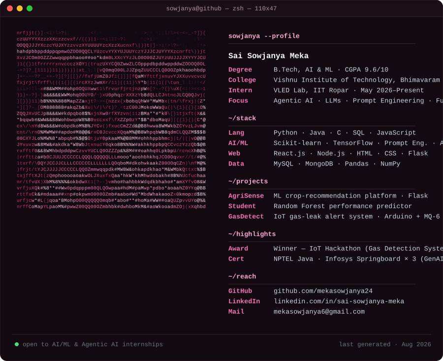

<h1 align="center">Hi there, I'm Sowjanya 👋</h1>

Research-oriented AI/ML undergraduate who likes turning models and prompts into things that actually ship — FAQ systems that answer real questions, dashboards farmers can use, and sensors that catch a gas leak before it becomes a headline.

  <picture>
    <source media="(prefers-color-scheme: dark)" srcset="./assets/dark.svg">
    <source media="(prefers-color-scheme: light)" srcset="./assets/light.svg">
    
  </picture>

---

### 🛠️ Tech Stack

**Programming:**     

**Core CS:** Data Structures & Algorithms · DBMS · Operating Systems · Computer Networks

**AI / ML:**   Agentic AI · Prompt Engineering · LLMs

**Data & Web:**   Matplotlib ·   

**Tools & Platforms:**     Power BI · Arduino IDE · VS Code

---

### 🚀 Projects

| Project | Stack | Description |
|---|---|---|
| **AgriSense**  2026 | Python, Flask, ML, HTML/CSS/JS | Smart agriculture platform giving farmers crop recommendations and data-driven decisions, with an interactive real-time prediction dashboard. |
| **Student Performance Prediction**  Dec 2024 – Jan 2025 | Python, Pandas, NumPy, Scikit-learn | Random Forest model predicting academic performance from a real-world educational dataset, reaching ~90% accuracy after preprocessing and feature selection. |
| **Smart Detection of Inflammable Gases**  Mar – Apr 2025 | Arduino, MQ-6 Sensor, IoT, Blynk | IoT gas-leakage detector with real-time monitoring, buzzer alerts, and automated exhaust-fan response for faster emergency reaction. 🏆 IoT Hackathon Winner. |

---

### 💼 Experience

**Research Intern** — VLED Lab, IIT Ropar · May 2026 – Present
Built an AI-powered FAQ generation system for the Samagama portal using LLMs, prompt engineering, and data preprocessing — working with a 12-member research team on Git/GitHub to improve response quality and consistency.

**Research & Development Associate** — E-Cell, Vishnu Institute of Technology · Nov 2025 – Apr 2026
Supported startup ideation, technical research, and project documentation; collaborated across teams on technical events and entrepreneurship initiatives.

---

### 🏆 Certifications & Awards

- 🏆 **Winner** — IoT Hackathon (Smart Detection of Inflammable Gases)
- ☕ **Programming in Java** — NPTEL
- 🤖 **AI First Software Engineering** — Infosys Springboard
- 💬 **OpenAI GPT for Developers** — Infosys Springboard
- ✍️ **Prompt Engineering** — Infosys Springboard

---

### 📫 Connect with me

